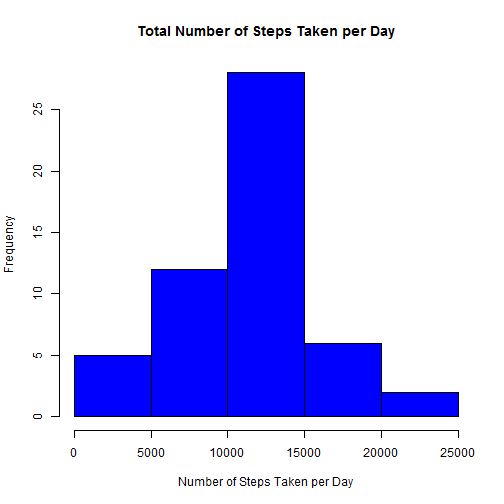
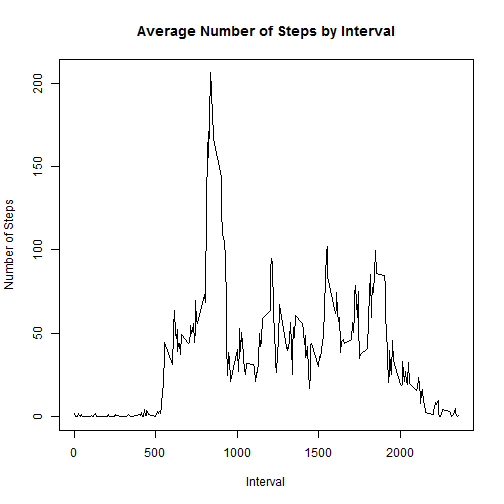
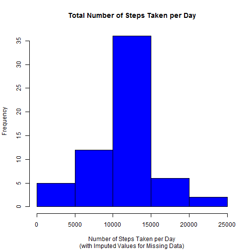
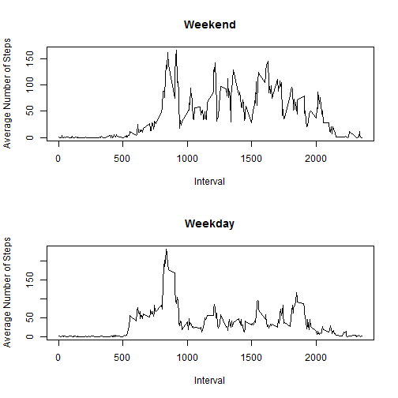

###Introduction
This project analyzes data from a personal activity monitoring device which collects data at 5 minute intervals throughout the data for the time period October to November 2012.

###Loading and Pre-processing the data
The activity monitoring data is loaded from a comma-delimited file.

```r
#Import data, set variable formats
raw <- read.csv("activity.csv", header=TRUE, 
            colClasses=c("numeric", "Date", "numeric"))

#Create data frame, removing records with NAs
activity <- na.exclude(raw)
```

###What is the mean total number of steps taken per day?
Using the activity data set, sum the steps by date and create a histogram:

```r
#Create dataset with total steps by date
agg_date <-aggregate(steps ~ date, data=activity, sum)

#Histogram of Number of Steps Taken per Day
hist(agg_date$steps, 
     freq=TRUE,
     col="blue", 
     xlab="Number of Steps Taken per Day",
     ylab="Frequency",
     main="Total Number of Steps Taken per Day"
)
```

 


```r
#Calculate mean 
mean(agg_date$steps)
```

```
## [1] 10766.19
```

```r
#Calculate median
median(agg_date$steps)
```

```
## [1] 10765
```

The mean of the total number of steps taken per day is 1.0766189 &times; 10<sup>4</sup>.

The median of the total number of steps taken per day is 1.0765 &times; 10<sup>4</sup>.

###What is the average daily activity pattern?
Examine the average daily activity pattern by looking at a line graph.

```r
#Create dataset with average steps by interval
agg_int <- aggregate(steps ~ interval, data=raw, mean)

#Line graph of average steps by interval
plot(agg_int$interval, agg_int$steps, type="l",
     xlab="Interval",
     ylab="Number of Steps",
     main="Average Number of Steps by Interval")
```

 


```r
#Find the interval that has the highest average number of steps
agg_int[round(agg_int$steps,4)==round(max(agg_int$steps),4), ]
```

```
##     interval    steps
## 104      835 206.1698
```
The interval (based on the average across all the days in the dataset) that contains the maximum number of steps is 835, at 206.17 steps.

###Imputing missing values

```r
#Determine the number of rows that have missing values
nrow(raw) - nrow(activity)
```

```
## [1] 2304
```
There are 2304 rows that have NAs in the original raw data set.

Create a new dataset, using the interval mean to fill in the missing values.

```r
#Create new dataset
full <- raw

#Assign average number of steps for interval if NA
for (n in 1:nrow(full)) {
        if (is.na(full$steps[n])) 
                {full$steps[n] <- agg_int$steps[agg_int$interval==full$interval[n]] }
}
```

Examine histogram of total steps by date using the new data set with imputed values

```r
#Create dataset with total steps by date
agg_full <- aggregate(steps ~ date, data=full, sum)

#Histogram of total steps by date
hist(agg_full$steps, 
     freq=TRUE,
     col="blue", 
     xlab="Number of Steps Taken per Day",
     ylab="Frequency",
     main="Total Number of Steps Taken per Day",
     sub="(with Imputed Values for Missing Data)"
)
```

 


```r
#Calculate the mean
mean(agg_full$steps)
```

```
## [1] 10766.19
```

```r
#Calculate the median
median(agg_full$steps)
```

```
## [1] 10766.19
```

The mean of the total number of steps taken per day is 1.0766189 &times; 10<sup>4</sup>.
The median of the total number of steps taken per day is 1.0766189 &times; 10<sup>4</sup>.

Thee mean and median from the imputed data set are similar to the dataset excluding missing values.  There is no impact to imputing missing data for this dataset.

###Are there differences in activity patterns between weekdays and weekends?
Determine if there differences by interval for weekends vs. weekdays:

```r
#Create dataset with average steps by interval for weekends
full$weekday <- as.factor(weekdays(full$date))
agg_weekend <- aggregate(steps ~ interval, data=subset(full, weekday=="Saturday" | weekday=="Sunday"), mean)

#Create dataset with average steps by interval for weekdays
agg_weekday <- aggregate(steps ~ interval, data=subset(full, weekday!="Saturday" & weekday!="Sunday"), mean)
```

Create panel plot of line graphs for weekend versus weekday average steps by interval:

```r
par(mfrow=c(2,1))

plot(agg_weekend$interval, agg_weekend$steps, type="l",
     xlab="Interval",
     ylab="Average Number of Steps",
     main="Weekend")
plot(agg_weekday$interval, agg_weekday$steps, type="l",
     xlab="Interval",
     ylab="Average Number of Steps",
     main="Weekday")
```

 

It appears there is a difference in the average number of steps by interval when comparing weekend to weekdays.
